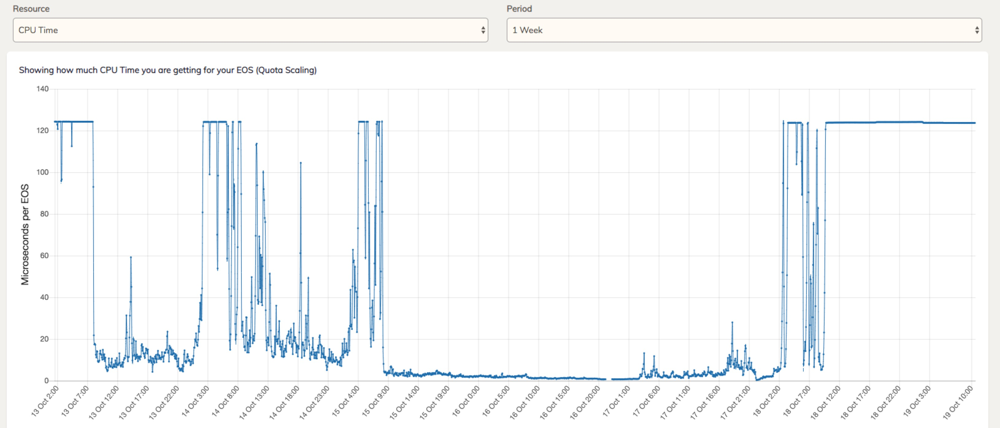

### EOSIO CPU 资源分配原理分析

众所周知，EOS 账户可以使用的 CPU 运算资源与账户抵押的 CPU 有关，抵押的越多，可以使用的资源就越多。每个 EOS 对应的 CPU 资源计算公式为: 

> 可用 CPU 毫秒数 = account_cpu_usage_average_window_ms * max_block_cpu_usage / block_interval_ms * your_staked_cpu_count / total_cpu_count

> 当前主网配置 max_block_cpu_usage = 200000

> (account_cpu_usage_average_window_ms * max_block_cpu_usage / block_interval_ms = 34560000000)

以主网 2018-10-19 为例，当前 CPU 总质押量为 280053493.80756617 EOS，那么可以算出每个 EOS 可以使用 123.40 us，也就是说质押 1000 个 EOS，才可以使用 123.40 ms的计算资源。

这样会带来一个问题就是质押量少的账户无法发起任何操作，不能转账，不能质押等等。

> 如同现实生活中的水、电和流量，忙时和闲时是分开定价的，使用价格手段鼓励用户错峰用电。EOS也允许用户在系统闲时使用更多的资源，在系统忙时保证能使用对应权重的资源，解决了以太坊拥堵时低gas交易无法打包的问题。

> 同样的钱，在闲时可以买到很多的水电，同理，抵押同样的代币，在系统闲时可使用更多的资源。
> 这里就引出 EOS 使用资源的基本原则：使用一分，记录一分。

> 为了实现动态调节的机理，EOS 引入了虚拟资源这一概念，最大可使用的虚拟资源为实际可使用的资源的1000倍，也就是说，用户在系统闲时可用的最大资源为实际可用的1000倍。

> 现实生活中的水、电的忙闲是通过时段区分的，比如白天是忙时，半夜是闲时。EOS则需要通过监测60s内的区块资源的使用情况来区分，现阶段是60s内的区块资源使用低于最大可用的10%，就（小比例）增加系统可用的虚拟资源，否则就（小比例）减少。

> 以上描述摘自 https://www.jianshu.com/p/f914fefa512f

因此 EOS 设计了两种 CPU 模式，拥堵模式以及空闲模式。

空闲模式下每个 EOS 可用的 CPU 资源乘以实际的1千倍，那么上面的公式应该再乘以1千，实际 1 EOS = 123.40 * 1000。
拥堵模式下每个 EOS 可用的 CPU 为实际抵押数值。

之前有个账户叫 blocktwitter 不知道大家有没有印象，为什么可以一直往主网发送垃圾消息，就是因为空闲模式下，他可以使用自己质押量 1000 倍的 CPU 资源。当这个账户被 BP 加入灰名单以后，相当于进入了拥堵模式，只能使用实际抵押的资源。

主网账户拥堵模式的触发条件是什么呢?有以下两种。 

> 1. EOS 账户被节点加入灰名单。
> 2. 过去 60 秒平均每个块的 CPU 使用量达到 max_block_cpu_usage * target_block_cpu_usage_pct，之前这个值是 20ms，昨天调整以后达到 40ms。

条件1是个别账户进入拥堵模式，对灰名单外的账户没有影响。

条件2是全网开始进入拥堵模式，每一分钟每个质押的 EOS 对应的 CPU 资源越来越少，经过687分钟 (log(0.0001) / log(0.99)) 的持续下降以后，每个质押的 EOS 实际使用量回到实际质押的值。

当然这个下降过程也会出现上升的情况。比如下降到一定程度以后，过去60秒每个块的平均 CPU 使用量没有达到40ms阈值了，又会开始上升。

下图是过去一周，主网每个 EOS 对应的 CPU 使用量变化图，每一分钟都在变化。

有同学问为什么不直接把 max_block_cpu_usage 跟 target_block_cpu_usage_pct 的值调到最大呢，这样可以最大范围的减少主网进入拥堵模式的次数。

昨天我们在 BP 群里有讨论过这个问题，主要考虑的因素是，目前各个 BP 的机器性能参差不齐，如果贸然的把这两个值调高，可能会导致节点 replay 变的更慢，同时对于配置低的机器来说，同步区块也会很吃力。总之大家还是决定稳一点慢慢来，目前来看昨天的调整，对节点之间的同步，CPU 使用率没有太大影响。不出意外的话下次会把 target_block_cpu_usage_pct 调到 30%。