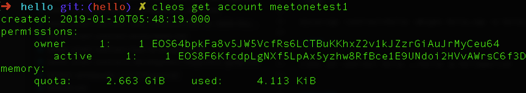
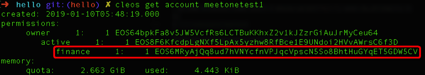
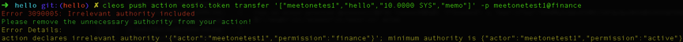
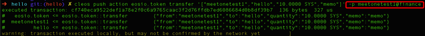
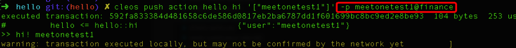
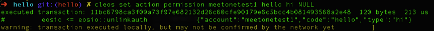
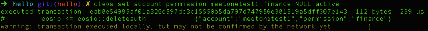
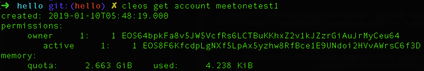

# EOS账户权限管理

> 支持我们，请投票给 rex.m

EOS提供了一套安全、灵活的权限管理机制，用户可以为自己的账户自定义一些权限操作。

## 准备工作

### 创建测试账户和合约账户

```
cleos create account eosio meetonetest1 <owner-key> <active-key> 
cleos create account eosio hello <owner-key> <active-key>
```
### 发放测试代币：

可参考[《eosio.token 合约分析》](eosio-smart-contract-eosio.token.md)给上述两个账户发放代币用于测试。
```
cleos push action eosio.token transfer '["eosio","meetonetest1","10000.0000 SYS","memo"]' -p eosio
cleos push action eosio.token transfer '["eosio","hello","10000.0000 SYS","memo"]' -p eosio
``` 

### hello 合约编译部署

智能合约相关可参考[《智能合约开发入门教程》](eosio-smart-contract-how-to-program.md)。
```c++
#include <eosiolib/eosio.hpp>

namespace meetone {

CONTRACT hello : public eosio::contract {
 public:
  using eosio::contract::contract;

  ACTION hi(eosio::name user) { eosio::print("hi! ", user.to_string()); }
};
}  // namespace meetone

EOSIO_DISPATCH(meetone::hello, (hi))
```
**编译：**
```
eosio-cpp -contract=hello -abigen hello.cpp -o hello.wasm
```
**部署：**
```
cleos set contract hello ../hello -p hello@active
```

## 添加权限

这是添加权限前meetonetest1账户:



现在添加`finance`权限只用于转账，除了转账外无法进行其他操作：
```

cleos set account permission meetonetest1(账户名) finance(权限名称) '{"threshold": 1, "keys":[{"key":"EOS6MRyAjQq8ud7hVNYcfnVPJqcVpscN5So8BhtHuGYqET5GDW5CV(权限公钥)","weight":1}],"accounts":[],"waits":[]}' active
```



可以看到在active权限底下增加了`finance`权限，但是此时使用`finance`权限进行任何操作都会抛出异常提示权限不足。



接下来我们给`finance`加入可以进行`eosio.token`合约的转账的权限，并测试转账功能：
```
cleos set action permission meetonetest1(账户名) eosio.token(合约) transfer(合约action) finance(被设置权限名)
```


此时`finance`具有了转账的权限，当然`finance`此时也是只能进行`eosio.token`合约的转账，无法进行其他类型的操作。如果想`finance`能再加入其他操作的权限也是可以：
```
cleos set action permission meetonetest1(账户名) hello(合约) hi(合约action) finance(被设置权限名)
```
这样`finance`就增加了可以执行`hello`合约`hi`的权限了。如果`meetonetest1`账户底下有权限已经加了该action，则权限会转移给`finance`，相应的之前的权限将失去执行`hi`action的权限。



## 解除权限绑定的action

假如不想要`finance`可以执行`hello`合约`hi`action的权限了，当然也是可以解除的：
```
cleos set action permission meetonetest1(账户名) hello(合约) hi(合约action) NULL(删除)
```



删除后使用`finance`权限执行`hello`合约`hi`action会抛出权限异常的错误。

## 删除权限

删除权限之前先要将之前和该权限绑定的所有action都解除，否则无法删除，如果忘记了之前绑定的action哪些action也不需要担心，命令行抛出的异常会给出提示。

```
cleos set account permission meetonetest1(账户) finance(需要删除的权限) NULL(代表删除) active(finance所属的父类权限)
```





## 总结

通过上述介绍的操作，就能很好的管理自己账户的权限，可以对账户进行权限的分层管理或者进行权限分离，提高账户的安全性。