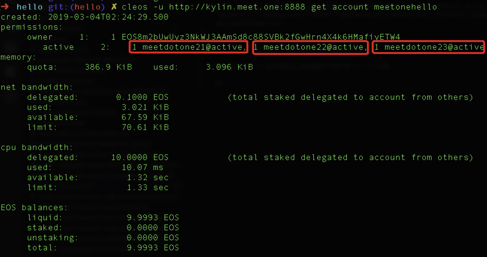
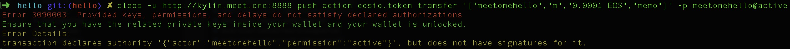
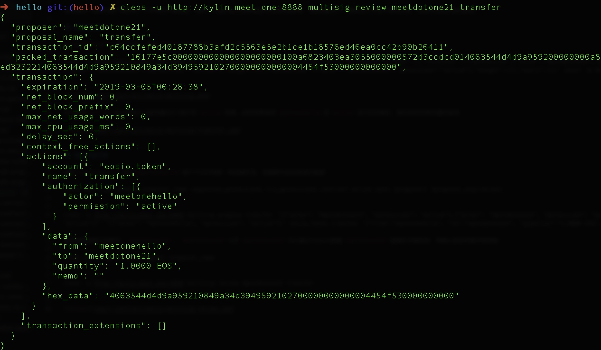
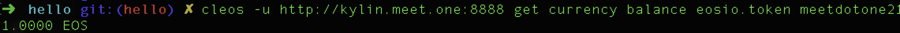

# EOSIO 账户多签管理

> 支持我们，请投票给 rex.m

当普通账户或合约账户拥有非个人所有的大量金额，则单个人最好是无法单独进行资金的转账等，而是需要多个人确定后才可执行某笔交易，这就涉及到多签的管理。

## 设置多签账户

以`meetonehello`账户为例，设置`hello`账户的权限`active`权限为多签：
```
cleos -u http://kylin.meet.one:8888 set account permission meetonehello active '{"threshold":2,"keys":[],"accounts":[{"permission":{"actor":"meetdotone21","permission":"active"},"weight":1},{"permission":{"actor":"meetdotone22","permission":"active"},"weight":1},{"permission":{"actor":"meetdotone23","permission":"active"},"weight":1}],"waits":[]}' owner -p meetonehello@active 
```



可以看到`active`由公钥变为上面设置的3个账户的`active`权限。此时如果使用`meetonehello`的`active`进行任何操作，都会返回权限问题的错误：




## 发起多签提案

此时`meetdotone21`想从`meetonehello`账户下对外转账一笔金额的话，就需要先发起转账的提案：
```
cleos multisig propose proposal_name requested_permissions trx_permissions contract action data [proposer] [proposal_expiration]
```
```
cleos -u http://kylin.meet.one:8888 multisig propose transfer '[{"actor": "meetdotone21", "permission": "active"},{"actor": "meetdotone22", "permission": "active"},{"actor": "meetdotone23", "permission": "active"}]' '[{"actor": "meetonehello", "permission": "active"}]' eosio.token transfer '{"from":"meetonehello", "to":"meetdotone21", "quantity":"1.0000 EOS", "memo":""}' -p meetdotone21@active
```
现在转账提案已经提交，`meetdotone21`、`meetdotone22`以及`meetdotone23`可以通过rewive查看`meetdotone21`提案的详细信息，再确认是否同意该笔转账：
```
cleos multisig review proposer proposal_name
```
```
cleos -u http://kylin.meet.one:8888 multisig review meetdotone21 transfer
```



## 批准多签提案

当确认`meetdotone21`发起的提案没有问题后，`meetdotone21`、`meetdotone22`以及`meetdotone23`任意两个账户以上同意即可：
```
cleos multisig approve proposer proposal_name permissions 
```
```
cleos -u http://kylin.meet.one:8888 multisig approve meetdotone21 transfer '{"actor": "meetdotone22", "permission": "active"}' -p meetdotone22@active
```
```
cleos -u http://kylin.meet.one:8888 multisig approve meetdotone21 transfer '{"actor": "meetdotone23", "permission": "active"}' -p meetdotone23@active
```

此时，`meetdotone22`和`meetdotone23`都同意这笔转账的多签提案，那么发起提案的`meetdotone21`就可以执行了：
```
cleos -u http://kylin.meet.one:8888 multisig exec meetdotone21 transfer -p meetdotone21@active
```


现在交易已经执行，可以看到`1 EOS `成功从`meetonehello`转给了`meetdotone21`。
