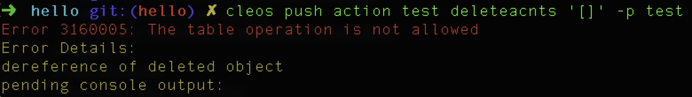

# multi_index 批量删除

> 支持我们，请投票给 rex.m

## 准备

表结构：

```c++
TABLE accounts {
  eosio::name owner;

  uint64_t primary_key() const { return owner.value; }

  EOSLIB_SERIALIZE(accounts,(owner))
};
```

添加数据：

```c++
ACTION addaccount(eosio::name account) {
  acnts_table acnts(get_self(), get_self().value);
  acnts.emplace(get_self(), [&](auto& a) { a.account = account; });
}
```

## 开始

合约开发过程中，常涉及到数据的删除，删除单条数据可以这么处理：

```c++
ACTION deleteacnt(eosio::name account){
  require_auth(get_self());
  acnts_table acnts(get_self(), get_self().value);
  auto it = acnts.require_find(account.value, "account not exists.");
  acnts.erase(it);
}
```

这样就可以删除对应用户名的那条记录。如果想删除整张表数据，通常如下处理：

```c++
ACTION deleteacnts() {
  require_auth(get_self());
  acnts_table acnts(get_self(), get_self().value);
  for (auto it = acnts.begin(); it != acnts.end(); ++it) {
    acnts.erase(it);
  }
}
```

但是这时候会执行失败：



原因是因为 erase 动作执行后 it 迭代器就立刻失效了。
正确的处理方法：

```c++
ACTION deleteacnts() {
  require_auth(get_self());
  acnts_table acnts(get_self(), get_self().value);
  for (auto it = acnts.begin(); it != acnts.end(); ) {
    it = acnts.erase(it);
  }
}
```

这样就可以删除表中所有数据，可以查看`multi_index`中`erase`的源码：

```c++
const_iterator erase(const_iterator itr) {
  eosio_assert(itr != cend(), "cannot pass end iterator to erase");

  const auto& obj = *itr;
  ++itr;

  _multidx->erase(obj);

  return itr;
}
```

源码中`erase`执行的完后会返回下一个迭代器的数据。
