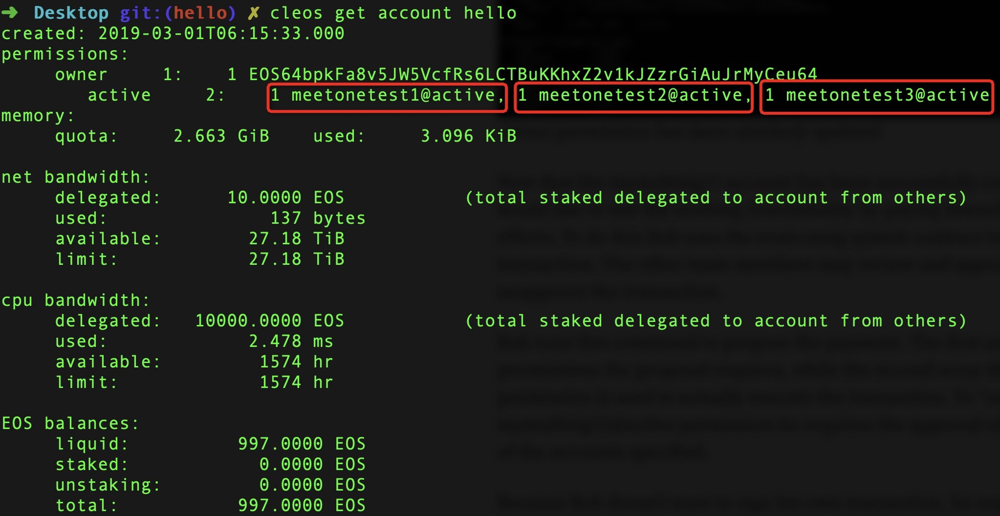

# EOSIO 多签的合约账户部署合约

为保证合约账户资金的安全以及合约的稳定，有时候管理员会将账户的权限设置为多签，此时部署合约需要先提交部署合约的提案由多签的管理账户同意后，才可以执行合约的部署。

## 账户准备

这里，我们创建了4个账户:

- `hello`: 多签的合约账户
- `meetonetest1`: 管理账户1 
- `meetonetest2`: 管理账户2
- `meetonetest3`: 管理账户3 

`hello`在刚创建时配置了一对`owner`和`active`密钥。在部署合约之前将`hello`账户的`active`权限设置为2/3的多签账户，即需要3个管理账户中的2个以上同意就可以授权`hello`的执行交易。



## 生成用于部署合约的交易

`hello`账户需要提交部署合约的事务的提案，以便在执行之前从管理账户处获得批准。提交部署合约事务的提案前首先得以JSON格式在本地生成并保存该笔事务：
生成并保存该笔事务的方法：
```
cleos set contract -s -j -d hello ../hello/ > deploy_hello_contract_trx.json
Reading WASM from /Users/linkai/Desktop/contract/hello/hello.wasm...
Publishing contract...
cat deploy_hello_contract_trx.json
{
  "expiration": "2019-03-06T08:58:31",
  "ref_block_num": 18387,
  "ref_block_prefix": 3717977643,
  "max_net_usage_words": 0,
  "max_cpu_usage_ms": 0,
  "delay_sec": 0,
  "context_free_actions": [],
  "actions": [{
      "account": "eosio",
      "name": "setcode",
      "authorization": [{
          "actor": "hello",
          "permission": "active"
        }
      ],
      "data": "00000000001aa36a0000dd590061736d0100000001bb011c60057f7e7e7f7f0060000060067f7f7f7f7f7f017f60077e7e7f7f7f7f7e017f6000017f60027f7f017f60027f7f0060047e7e7e7e017f60047f7f7f7f017f6000017e60037f7f7f017f60067e7e7e7e7f7f017f60047f7e7f7f0060057f7e7e7e7e0060027e7e017f60027f7c0060027f7d0060027e7e017c60027e7e017d60037e7e7e0060037e7e7f017f60037f7f7e0060037f7f7f0060047f7f7e7f0060047f7f7f7f0060017f017f60017f0060087f7f7f7f7f7f7f7f0002ac052303656e761f636865636b5f7472616e73616374696f6e5f617574686f72697a6174696f6e000203656e761e636865636b5f7065726d697373696f6e5f617574686f72697a6174696f6e000303656e7610616374696f6e5f646174615f73697a65000403656e7610726561645f616374696f6e5f64617461000503656e76087072696e74735f6c000603656e760c656f73696f5f617373657274000603656e760b64625f66696e645f693634000703656e760a6765745f616374696f6e000803656e761063757272656e745f7265636569766572000903656e76066d656d637079000a03656e760c64625f73746f72655f693634000b03656e760a64625f6765745f693634000a03656e760d64625f7570646174655f693634000c03656e760561626f7274000103656e76066d656d736574000a03656e76076d656d6d6f7665000a03656e760a5f5f756e6f7264746632000703656e76075f5f6571746632000703656e76085f5f6d756c746633000d03656e76085f5f616464746633000d03656e76085f5f737562746633000d03656e76075f5f6e65746632000703656e760c5f5f666978756e7374667369000e03656e760d5f5f666c6f6174756e73697466000603656e76095f5f66697874667369000e03656e760b5f5f666c6f617473697466000603656e760d5f5f657874656e646466746632000f03656e760d5f5f657874656e647366746632001003656e76085f5f646976746633000d03656e76075f5f6c65746632000703656e760c5f5f7472756e637466646632001103656e76075f5f6765746632000703656e760c5f5f7472756e637466736632001203656e76207365745f626c6f636b636861696e5f706172616d65746572735f7061636b6564000603656e76206765745f626c6f636b636861696e5f706172616d65746572735f7061636b65640005032c2b0106130014060615160505171705180505060519191a1a050506061a051b06080a1a041a190a051905191a0405017001020205030100010616037f014180c0000b7f00418485010b7f00418485010b07ad010c066d656d6f727902000b5f5f686561705f6261736503010a5f5f646174615f656e640302056170706c790025065f5a646c50760038055f5a6e776a0036055f5a6e616a0037065f5a646150760039145f5a6e776a53743131616c69676e5f76616c5f74003a145f5a6e616a53743131616c69676e5f76616c5f74003b155f5a646c507653743131616c69676e5f76616c5f74003c155f5a6461507653743131616c69676e5f76616c5f74003d0907010041010b01260adb4c2b02000bbe0201067f0240024002400240024020002802082202200028020422036b20014f0d002003200028020022046b220520016a2206417f4c0d0241ffffffff0721070240200220046b220241feffffff034b0d0020062002410174220220022006491b2207450d020b2007103621020c030b200041046a21000340200341003a00002000200028020041016a22033602002001417f6a22010d000c040b0b41002107410021020c010b20001044000b200220076a2107200320016a20046b2104200220056a220521030340200341003a0000200341016a21032001417f6a22010d000b200220046a21042005200041046a2206280200200028020022016b22036b2102024020034101480d0020022001200310091a200028020021010b2000200236020020062004360200200041086a20073602002001450d00200110380f0b0b4d01017f230041106b2203240010230240200242808080b8d585cfe64d520d002003410036020c200341013602082003200329030837030020002001200310271a0b41001046200341106a24000bce0a03017f027e047f230041f0006b220524002003290300210641002103200541d8006a41003602002005427f370348200542003703502005200029030022073703382005200737034020052006370310200541386a200541106a2007102a200541106a41014100102b2005410036020820054200370300200541246a2802002200200528022022086b2209410475ad2107200541206a210a03402003417f6a2103200742078822074200520d000b4100210b02400240024020082000460d0041002100200941707122082003460d02200820036b21030c010b410020036b21030b2005200310242005280204210b200528020021000b20052000360264200520003602602005200b360268200541e0006a200a102c1a2005280200210a0240024002400240200541206a28020029030022074200510d004100210041002802fc42210b02400340200541e0006a200022036a200b20074280808080808080807883423c423b2003410c461b88a76a2d00003a0000200341016a21002003410b4b0d01200742058622074200520d000b0b200541086a4100360200200542003703002000410b4f0d01200520004101743a00002005410172210b0c020b200541086a410036020020054200370300200541003a0000200541017221030c020b200041106a41707122081036210b200520084101723602002005200b360208200520003602040b200341016a2108410021030340200b20036a200541e0006a20036a2d00003a00002008200341016a2203470d000b200b20006a21030b200341003a0000200541e0006a41086a2200200541004180c0001043220341086a220b2802003602002005200329020037036020034200370200200b41003602002000280200200541e0006a41017220052d00602203410171220b1b20052802642003410176200b1b1004024020052d0060410171450d00200028020010380b024020052d0000410171450d00200528020810380b0240024002400240200541206a28020029030822074200510d004100210041002802fc42210b02400340200541e0006a200022036a200b20074280808080808080807883423c423b2003410c461b88a76a2d00003a0000200341016a21002003410b4b0d01200742058622074200520d000b0b200541086a4100360200200542003703002000410b4f0d01200520004101743a00002005410172210b0c020b200541086a410036020020054200370300200541003a0000200541017221030c020b200041106a41707122081036210b200520084101723602002005200b360208200520003602040b200341016a2108410021030340200b20036a200541e0006a20036a2d00003a00002008200341016a2203470d000b200b20006a21030b200341003a0000200541e0006a41086a2200200541004180c0001043220341086a220b2802003602002005200329020037036020034200370200200b41003602002000280200200541e0006a41017220052d00602203410171220b1b20052802642003410176200b1b10040240024002400240024020052d00604101710d0020052d00004101710d010c020b2000280200103820052d0000410171450d010b20052802081038200a0d010c020b200a450d010b200a10380b0240200528022c2203450d00200541306a2003360200200310380b024020052802202203450d00200541246a2003360200200310380b02402005280250220b450d0002400240200541d4006a22082802002203200b460d000340200341686a220328020021002003410036020002402000450d00200010380b200b2003470d000b200541d0006a28020021030c010b200b21030b2008200b360200200310380b200541f0006a24000bba0301047f230041a0016b2203240020032204200229020037037841002102024010022205450d00024002402005418104490d002005104a21020c010b20032005410f6a4170716b220224000b2002200510031a0b200441c8006a41186a4200370300200441f0006a4100360200200442003703502004420037034820044200370358200442003703682004200236023c200420023602382004200220056a3602402004200441386a360290012004200441c8006a360218200441186a20044190016a1028200441086a41086a220320042802403602002004200429033837030820044180016a41086a22062003280200360200200420042903083703800120044190016a41086a20062802002203360200200441186a41186a200336020020042000370318200420013703202004200429038001220037032820042000370390012004200441f8006a360294012004200441186a3602900120044190016a200441c8006a102902400240024020054181044f0d004101210220042d00684101710d010c020b2002104d4101210220042d0068410171450d010b200441f0006a2802001038200441a0016a240020020f0b200441a0016a240020020be10201047f230041106b2202240020002802002103024020012802002204280208200428020422056b41074b0d00410041aec1001005200441046a28020021050b20032005410810091a200441046a2204200428020041086a3602002000280200220541086a2103024020012802002204280208200428020422006b41074b0d00410041aec1001005200441046a28020021000b20032000410810091a200441046a2204200428020041086a360200200541106a2103024020012802002204280208200428020422006b41074b0d00410041aec1001005200441046a28020021000b20032000410810091a200441046a2200200028020041086a2203360200200242003703080240200441086a28020020036b41074b0d00410041aec1001005200028020021030b200241086a2003410810091a200541186a20022903083703002000200028020041086a3602002001280200200541206a10351a200241106a24000bbb0203027f027e027f230041e0006b22022400200241206a41086a2203200141186a290300370300200220012903103703202001290308210420012903002105200241106a200141206a103f2101200241306a41086a20032903003703002002200229032037033020002802002000280204220028020422064101756a21032000280200210002402006410171450d00200328020020006a28020021000b200241d0006a41086a2207200241306a41086a29030037030020022002290330370350200241c0006a2001103f2106200241086a20072903003703002002200229035037030020032005200420022006200011000002400240024020022d00404101710d0020012d00004101710d010c020b2006280208103820012d0000410171450d010b20012802081038200241e0006a24000f0b200241e0006a24000bbe0101027f230041106b220324000240024002402000411c6a28020022042000280218460d000240200441686a28020022042802082000460d004100418ec00010050b20040d010c020b2000290300200029030842808080808080c4d13b42808080808080c4d13b100622044100480d0120002004102d22042802082000460d004100418ec00010050b200320013602002000200420022003102e200341106a24000f0b20032001360208200320002002200341086a102f200341106a24000bd50101037f230041106b22032104200324000240024002400240024020012002410041001007220541004c0d002005418104490d010c020b410041cdc200100520054181044f0d010b20032005410f6a4170716b22032400200520012002200320051007460d020c010b2005200120022005104a220320051007460d010b410041e4c20010050b200042003703082000420037030020004200370310200041186a4200370300200041206a420037020020042003360204200420033602002004200320056a3602082004200010301a200441106a24000bc70203017f017e047f230041106b22022400200128020420012802006b410475ad210320002802042104200041086a210503402003a721062002200342078822034200522207410774200641ff0071723a000f0240200528020020046b41004a0d0041004194c2001005200041046a28020021040b20042002410f6a410110091a200041046a2204200428020041016a220436020020070d000b024020012802002207200141046a2802002201460d00200041086a2105200041046a210603400240200528020020046b41074a0d0041004194c2001005200628020021040b20042007410810091a2006200628020041086a22043602000240200528020020046b41074a0d0041004194c2001005200628020021040b2004200741086a410810091a2006200628020041086a2204360200200741106a22072001470d000b0b200241106a240020000b940301067f230041206b22022103200224000240200028021822042000411c6a2802002205460d0002400340200541786a2802002001460d012004200541686a2205470d000c020b0b20042005460d00200541686a2802002105200341206a240020050f0b024002400240200141004100100b2204417f4c0d0020044181044f0d0120022004410f6a4170716b22022400410021060c020b41004197c10010050b2004104a2102410121060b200120022004100b1a41181036220520003602080240200441074b0d00410041aec10010050b20052002410810091a2005200136020c20032005360218200342808080808080c4d13b3703102003200136020c0240024002402000411c6a22072802002204200041206a2802004f0d00200442808080808080c4d13b3703082004200136021020034100360218200420053602002007200441186a36020020060d010c020b200041186a200341186a200341106a2003410c6a10312006450d010b2002104d0b200328021821012003410036021802402001450d00200110380b200341206a240020050b8b0101027f230022042105024020012802082000460d00410041b3c10010050b024020002903001008510d00410041e1c10010050b20012003280200290300370300200441706a2203240020032001410810091a200128020c200220034108100c0240200029031042808080808080c4d13b560d00200041106a42818080808080c4d13b3703000b200524000bc70201047f230041206b22042400024020012903001008510d004100419ac20010050b411810362205200136020820052003280200290300370300200441106a2005410810091a2005200129030842808080808080c4d13b200242808080808080c4d13b200441106a4108100a220636020c0240200129031042808080808080c4d13b560d00200141106a42818080808080c4d13b3703000b20042005360208200442808080808080c4d13b37031020042006360204024002402001411c6a22072802002203200141206a2802004f0d00200342808080808080c4d13b3703082003200636021020044100360208200320053602002007200341186a3602000c010b200141186a200441086a200441106a200441046a10310b2000200536020420002001360200200428020821012004410036020802402001450d00200110380b200441206a24000b970101037f02402000280208200028020422026b41074b0d00410041aec1001005200041046a28020021020b20012002410810091a200041046a2202200228020041086a2203360200200141086a21040240200041086a28020020036b41074b0d00410041aec1001005200228020021030b20042003410810091a2002200228020041086a3602002000200141106a10322001411c6a10330baa0301057f024002402000280204200028020022046b41186d220541016a220641abd5aad5004f0d0041aad5aad500210702400240200028020820046b41186d220441d4aad52a4b0d0020062004410174220720072006491b2207450d010b200741186c103621040c020b41002107410021040c010b20001044000b20012802002106200141003602002004200541186c22086a2201200636020020012002290300370308200120032802003602102004200741186c6a2105200141186a210602400240200041046a280200220220002802002207460d00200420086a41686a21010340200241686a220428020021032004410036020020012003360200200141106a200241786a280200360200200141086a200241706a290300370300200141686a21012004210220072004470d000b200141186a2101200041046a2802002107200028020021020c010b200721020b20002001360200200041046a2006360200200041086a2005360200024020072002460d000340200741686a220728020021012007410036020002402001450d00200110380b20022007470d000b0b02402002450d00200210380b0bfb0203017f017e047f2000280204210242002103200041086a2104200041046a2105410021060340024020022004280200490d00410041f6c2001005200528020021020b20022d000021072005200241016a22023602002003200741ff0071200641ff0171220674ad842103200641076a2106200221022007418001710d000b02400240024020012802042204200128020022076b41047522062003a722024f0d002001200220066b103420012802002207200141046a2802002204470d010c020b0240200620024d0d00200141046a200720024104746a22043602000b20072004460d010b200041046a22022802002106200041086a210503400240200528020020066b41074b0d00410041aec1001005200228020021060b20072006410810091a2002200228020041086a22063602000240200528020020066b41074b0d00410041aec1001005200228020021060b200741086a2006410810091a2002200228020041086a2206360200200741106a22072004470d000b0b20000ba10203017f017e057f2000280204210242002103200041086a2104200041046a2105410021060340024020022004280200490d00410041f6c2001005200528020021020b20022d000021072005200241016a22083602002003200741ff0071200641ff0171220274ad842103200241076a2106200821022007418001710d000b0240024020012802042207200128020022026b22052003a722064f0d002001200620056b1024200041046a2802002108200141046a2802002107200128020021020c010b200520064d0d00200141046a200220066a22073602000b0240200041086a28020020086b200720026b22074f0d00410041aec1001005200041046a28020021080b20022008200710091a200041046a2202200228020020076a36020020000bfc0201067f0240024002400240024020002802082202200028020422036b41047520014f0d002003200028020022046b410475220320016a22054180808080014f0d0241ffffffff0021060240200220046b220241047541feffff3f4b0d0020052002410375220620062005491b2206450d0220064180808080014f0d040b2006410474103621020c040b2003210620012102034020064200370300200641086a4200370300200641106a21062002417f6a22020d000b200041046a200320014104746a3602000f0b41002106410021020c020b20001044000b100d000b200220064104746a2104200220034104746a2203210620012102034020064200370300200641086a4200370300200641106a21062002417f6a22020d000b200320014104746a21052003200041046a2207280200200028020022066b22026b2101024020024101480d0020012006200210091a200028020021060b2000200136020020072005360200200041086a200436020002402006450d00200610380b0b9d0301067f230041206b2202240020024100360218200242003703102000200241106a10331a024002400240024002400240024002402002280214200228021022036b2204450d00200241086a410036020020024200370300200441704f0d052004410a4b0d01200220044101743a0000200241017221050c020b20012d00004101710d02200141003b0100200141086a21030c030b200441106a4170712206103621052002200641017236020020022005360208200220043602040b20042107200521060340200620032d00003a0000200641016a2106200341016a21032007417f6a22070d000b200520046a41003a00000240024020012d00004101710d00200141003b01000c010b200128020841003a0000200141003602040b200141001041200141086a200241086a2802003602002001200229030037020020022802102203450d040c030b200128020841003a000020014100360204200141086a21030b2001410010412003410036020020014200370200200228021022030d010c020b2002103e000b20022003360214200310380b200241206a240020000b3801027f02402000410120001b2201104a22000d0003404100210041002802a4432202450d0120021101002001104a2200450d000b0b20000b0600200010360b0e0002402000450d002000104d0b0b0600200010380b6b01027f230041106b2202240002402002410c6a20014104200141044b1b22012000410120001b22031048450d000240034041002802a4432200450d0120001101002002410c6a2001200310480d000c020b0b2002410036020c0b200228020c2100200241106a240020000b080020002001103a0b0e0002402000450d002000104d0b0b080020002001103c0b0500100d000bc20101037f20004200370200200041086a22024100360200024020012d00004101710d00200020012902003702002002200141086a28020036020020000f0b02402001280204220241704f0d0020012802082103024002402002410b4f0d00200020024101743a0000200041016a210120020d01200120026a41003a000020000f0b200241106a4170712204103621012000200441017236020020002001360208200020023602040b20012003200210091a200120026a41003a000020000f0b100d000b860201037f0240416e20016b2002490d0002400240024020002d00004101710d00200041016a2108416f2109200141e6ffffff074d0d010c020b20002802082108416f2109200141e6ffffff074b0d010b410b21092001410174220a200220016a22022002200a491b2202410b490d00200241106a41707121090b20091036210202402004450d0020022008200410091a0b02402006450d00200220046a2007200610091a0b0240200320056b220320046b2207450d00200220046a20066a200820046a20056a200710091a0b02402001410a460d00200810380b20002002360208200020094101723602002000200320066a2204360204200220046a41003a00000f0b100d000bf00201077f0240024002400240200141704f0d000240024020002d000022024101710d0020024101762103410a21040c010b20002802002202417e71417f6a2104200028020421030b410a2105024020032001200320014b1b2201410b490d00200141106a417071417f6a21050b02400240024020052004460d0002402005410a470d0041012106200041016a210120002802082104410021074101210820024101710d030c050b200541016a10362101200520044b0d0120010d010b0f0b024020002d000022024101710d0041012107200041016a210441002106410121082002410171450d030c010b200028020821044101210641012107410121082002410171450d020b200028020441016a2202450d030c020b100d000b200241fe017120087641016a2202450d010b20012004200210091a0b02402006450d00200410380b02402007450d0020002003360204200020013602082000200541016a4101723602000f0b200020034101743a00000bb40201037f0240024002400240024020002d0000220441017122050d002004410176220420014f0d010c020b200028020422042001490d010b410a210602402005450d002000280200417e71417f6a21060b0240024002400240200620046b20034f0d0020002006200420036a20066b2004200141002003200210400c010b2003450d0020050d01200041016a220520016a2106200420016b2201450d020c040b20000f0b2000280208220520016a2106200420016b22010d020b200620022003100f1a0c020b100d000b200620036a20062001100f1a2006200220036a2002200520046a20024b1b2002200620024d1b2003100f1a0b200420036a2103024020002d00004101710d00200020034101743a0000200520036a41003a000020000f0b20002003360204200520036a41003a000020000b0e002000200120022002104710420b0500100d000b060041a8c3000b02000bad0101037f200021010240024002402000410371450d0020002d0000450d01200041016a210103402001410371450d0120012d00002102200141016a2203210120020d000b2003417f6a20006b0f0b2001417c6a21010340200141046a22012802002202417f73200241fffdfb776a7141808182847871450d000b200241ff0171450d01034020012d00012102200141016a2203210120020d000b200320006b0f0b200020006b0f0b200120006b0b3301017f411621030240024020014104490d002001200210492201450d0120002001360200410021030b20030f0b10452802000bf50101067f4100210202400240410020006b22032000712000470d00200041104b0d012001104a0f0b1045411636020041000f0b0240024002402000417f6a220420016a104a2200450d002000200420006a2003712202460d012000417c6a220328020022044107712201450d02200020044178716a220441786a2205280200210620032001200220006b2207723602002002417c6a200420026b2203200172360200200241786a20064107712201200772360200200520012003723602002000104d0b20020f0b20000f0b200241786a200041786a280200200220006b22006a3602002002417c6a200328020020006b36020020020b0a0041b8c3002000104b0bd404010c7f02402001450d00024020002802c04122020d0041102102200041c0c1006a41103602000b200141086a200141046a41077122036b200120031b210302400240024020002802c441220420024f0d0020002004410c6c6a4180c0006a2101024020040d0020004184c0006a22022802000d0020014180c000360200200220003602000b200341046a2104034002402001280208220220046a20012802004b0d00200128020420026a2202200228020041808080807871200372360200200141086a2201200128020020046a3602002002200228020041808080807872360200200241046a22010d030b2000104c22010d000b0b41fcffffff0720036b2105200041c8c1006a2106200041c0c1006a210720002802c841220821020340024020002002410c6c6a22014188c0006a28020020014180c0006a2209280200460d00410041c1c00010050b20014184c0006a280200220a41046a21020340200a20092802006a210b2002417c6a220c280200220d41ffffffff077121010240200d4100480d000240200120034f0d000340200220016a2204200b4f0d01200428020022044100480d012001200441ffffffff07716a41046a22012003490d000b0b200c2001200320012003491b200d41808080807871723602000240200120034d0d00200220036a200520016a41ffffffff07713602000b200120034f0d040b200220016a41046a2202200b490d000b4100210120064100200628020041016a220220022007280200461b220236020020022008470d000b0b20010f0b200c200c2802004180808080787236020020020f0b41000b990501087f20002802c44121010240024041002d00b043450d0041002802b44321020c010b3f002102410041013a00b0434100200241107422023602b4430b200221030240024002400240200241ffff036a41107622043f0022054d0d00200420056b40001a4100210520043f00470d0141002802b44321030b41002105410020033602b44320024100480d002001410c6c210402400240200241ffff037122054180f8034b0d002002418080046a20056b21050c010b2002418080086a200241ffff07716b21050b200020046a2104200520026b2102024041002d00b0430d003f002103410041013a00b0434100200341107422033602b4430b20044180c0006a210420024100480d01200321060240200241076a417871220720036a41ffff036a41107622053f0022084d0d00200520086b40001a20053f00470d0241002802b44321060b4100200620076a3602b4432003417f460d0120002001410c6c6a22014184c0006a2802002206200428020022056a2003460d020240200520014188c0006a22072802002201460d00200620016a2206200628020041808080807871417c20016b20056a72360200200720042802003602002006200628020041ffffffff07713602000b200041c4c1006a2204200428020041016a220436020020002004410c6c6a22004180c0006a2205200236020020004184c0006a20033602000b20050f0b02402004280200220520002001410c6c6a22034188c0006a22012802002202460d0020034184c0006a28020020026a2203200328020041808080807871417c20026b20056a72360200200120042802003602002003200328020041ffffffff07713602000b2000200041c4c1006a220228020041016a22033602c0412002200336020041000f0b2004200520026a36020020040b7c01037f024002402000450d0041002802f8840122014101480d0041b8830121022001410c6c41b883016a21030340200241046a2802002201450d010240200141046a20004b0d00200120022802006a20004b0d030b2002410c6a22022003490d000b0b0f0b2000417c6a2202200228020041ffffffff07713602000b0bfc030d004180c0000b0e7065726d697373696f6e203d200000418ec0000b89016f626a6563742070617373656420746f206974657261746f725f746f206973206e6f7420696e206d756c74695f696e646578006d616c6c6f635f66726f6d5f6672656564207761732064657369676e656420746f206f6e6c792062652063616c6c6564206166746572205f686561702077617320636f6d706c6574656c7920616c6c6f636174656400004197c1000b176572726f722072656164696e67206974657261746f72000041aec1000b0572656164000041b3c1000b2e6f626a6563742070617373656420746f206d6f64696679206973206e6f7420696e206d756c74695f696e646578000041e1c1000b3363616e6e6f74206d6f64696679206f626a6563747320696e207461626c65206f6620616e6f7468657220636f6e747261637400004194c2000b0677726974650000419ac2000b3363616e6e6f7420637265617465206f626a6563747320696e207461626c65206f6620616e6f7468657220636f6e7472616374000041cdc2000b176765745f616374696f6e2073697a65206661696c6564000041e4c2000b126765745f616374696f6e206661696c6564000041f6c2000b04676574000041fcc2000b0480210000004180c3000b212e31323334356162636465666768696a6b6c6d6e6f707172737475767778797a00"
    },{
      "account": "eosio",
      "name": "setabi",
      "authorization": [{
          "actor": "hello",
          "permission": "active"
        }
      ],
      "data": "00000000001aa36a8f010e656f73696f3a3a6162692f312e3100030462696c6c000106616d6f756e740675696e7436340a64656c65746562696c6c00000a6d6f6469667962696c6c000106616d6f756e740675696e7436340200408ceea8aca24a0a64656c65746562696c6c0000408ceef8e512950a6d6f6469667962696c6c0001000000000010a33b0369363400000462696c6c00000000"
    }
  ],
  "transaction_extensions": [],
  "signatures": [],
  "context_free_data": []
}
```

需要修改`ref_block_num`和`ref_block_prefix`的值为`0`，而`expiration`的时间要设置成你部署合约的期限之后，需要在你设置的时间之前完成合约的部署。修改后的deploy_hello_contract_trx.json前几行的内容如下：
```
{
  "expiration": "2019-03-06T10:00:00",
  "ref_block_num": 0,
  "ref_block_prefix": 0,
  "max_net_usage_words": 0,
  "max_cpu_usage_ms": 0,
  "delay_sec": 0,
  "context_free_actions": [],
  "actions": [{
```

同时需要创建一个管理者权限账户的`manager_permission.json`文件：
```
[
  {"actor": "meetonetest1", "permission": "active"},
  {"actor": "meetonetest2", "permission": "active"},
  {"actor": "meetonetest3", "permission": "active"}
]
```

## 提交部署合约事务的提案

只有多签的中的任意一个管理账户才可以提交`hello`部署合约事务的提案，同时提交部署合约提案的管理者需要暂时为提交的提案提供RAM，不过RAM会在提交的提案被执行后自动返回给该管理者。
这里将以`meetonetest1`来提交事务：
```
cleos multisig propose_trx deployhello manager_permission.json deploy_hello_contract_trx.json meetonetest1
executed transaction: 1f0a3557824ae1f1610c0b70a2ab2c7828b920407c0e4241ef7c023c6f11cebc  11896 bytes  4046 us
#    eosio.msig <= eosio.msig::propose          {"proposer":"meetonetest1","proposal_name":"deployhello","requested":[{"actor":"meetonetest1","permi...
warning: transaction executed locally, but may not be confirmed by the network yet         ] 
```

## 批准部署合约事务的提案

当管理者都同意该笔事务的提案时：
```
cleos multisig approve meetonetest1 deployhello '{"actor":"meetonetest2","permission":"active"}' -p meetonetest2@active
executed transaction: 8df616f038970b017162ea537ffa3451fde4b7401604318d1f52e3e4b3e75308  128 bytes  252 us
#    eosio.msig <= eosio.msig::approve          {"proposer":"meetonetest1","proposal_name":"deployhello","level":{"actor":"meetonetest2","permission...
warning: transaction executed locally, but may not be confirmed by the network yet       
```

## 执行提案部署合约

当需要的批准数满足要求时（3个管理者中，至少有2个管理者批准），任何一个管理者都可以使用`eosio.misg::exec`action执行该事务部署合约：
```
cleos multisig exec meetonetest1 deployhello meetonetest1                                                
executed transaction: 3e09349fbe9278f9c5c38543d041bdfa82b5821e269ca8c20433f8565dc0489c  160 bytes  2144 us
#    eosio.msig <= eosio.msig::exec             {"proposer":"meetonetest1","proposal_name":"deployhello","executer":"meetonetest1"}
warning: transaction executed locally, but may not be confirmed by the network yet         ] 
```
在本地测试时候此时可能会出现错误的提示：
```
Error 3090003: Provided keys, permissions, and delays do not satisfy declared authorizations
Ensure that you have the related private keys inside your wallet and your wallet is unlocked.
Error Details:
transaction declares authority '{"actor":"hello","permission":"active"}', but does not have signatures for it under a provided delay of 0 ms, provided permissions [{"actor":"eosio.msig","permission":"eosio.code"}], provided keys [], and a delay max limit of 3888000000 ms
pending console output: 
```
这是因为本地的eosio.misg账户没有非特权账户。
没有设置之前：
```
cleos get account eosio.msig                                                                                           
created: 2019-03-01T06:14:52.000
permissions: 
```
设置之后：
```
cleos push action eosio setpriv '["eosio.msig", 1]' -p eosio
cleos get account eosio.msig                                
created: 2019-03-01T06:14:52.000
privileged: true
permissions:
```

以上便是给多签的账户部署合约的流程。


